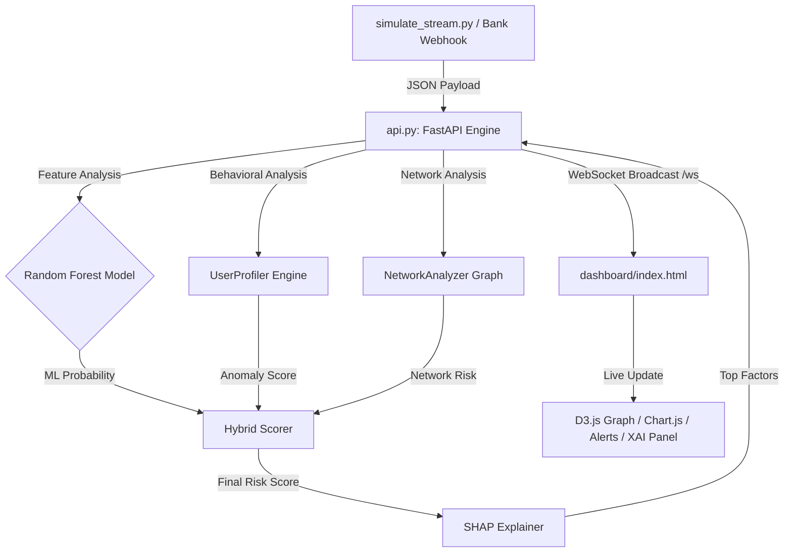
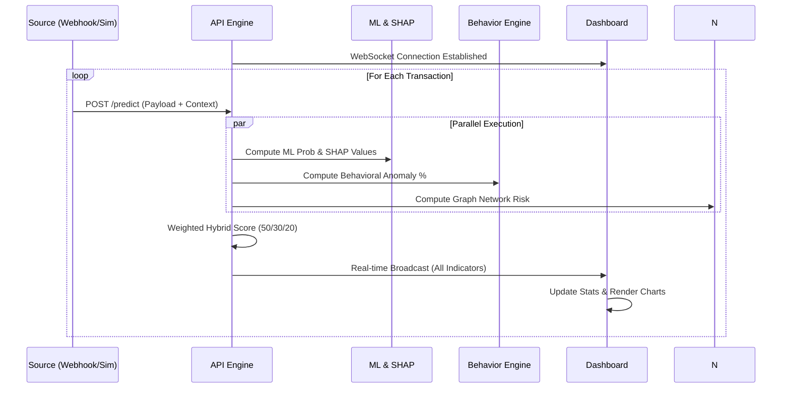

# 🏗️ System Architecture

This document provides a technical blueprint of the Fraud Risk Engine & Dashboard, detailing how components interact to provide real-time fraud detection.

## 🔄 High-Level Data Flow

**Core Solution Architecture Pipeline:**
`Transaction stream` ➜ `Feature engineering` ➜ `ML classifier` ➜ `Fraud scoring`

Building on this core pipeline, the system operates as a hybrid reactive pipeline. Data flows from sensors/simulators through parallel intelligence paths (ML + Behavioral) before being explained by SHAP and broadcast to the dashboard.

## 🏗️ Component Breakdown

### 1. Hybrid Intelligence Engine (`api.py`)
The central nervous system of the platform. It handles:
- **Normalization Layer**: Centralized mapper for Webhooks, Emails, and Streams.
- **ML Pathway**: Real-time inference using Random Forest + SHAP for feature-level explanations.
- **Behavioral Pathway**: Advanced `UserProfiler` with persistence (SQLite), tracking velocity, geography, and spending baselines.
- **Network Pathway**: `NetworkAnalyzer` builds persistent graph edges to detect cycles (rings) and mule hub surges.
- **Persistence Layer**: `DatabaseManager` ensures that user reputation and network relationships survive system restarts.
- **Real-Time Sink**: High-performance WebSocket management for zero-refresh UI updates.

### 2. Dashboard Analytics (`dashboard/`)
The frontend is a reactive surveillance suite:
- **Topology Monitor**: D3.js powered graph showing the live transaction network and high-risk clusters.
- **Risk Distribution**: Real-time pie-chart view of system-wide risk levels.
- **Activity Timeline**: Visualizes transaction volume surges and volatility.
- **XAI & Behavioral Panels**: Deep-dive sections showing AI reasoning and behavioral violation alerts.

### 3. Simulation & Ingestion Tools
- **`simulate_stream.py`**: High-fidelity transaction generator that mimics real-user behaviors and injects intentional anomalies.
- **Multi-Source Ready**: API supports direct ingestion from payment gateways (`/webhook/payment`) and email alerts (`/transaction/email`).

## 🛠️ Tech Stack Rationale

| Layer | Technology | Rationale |
| :--- | :--- | :--- |
| **Backend** | FastAPI | High performance, async I/O, and automated documentation. |
| **ML Model** | Random Forest | Effective for tabular data and supported by SHAP's fast `TreeExplainer`. |
| **Explainability** | SHAP | Gold standard for feature importance and prediction transparency. |
| **Behavioral** | In-Memory | High-speed profiling for low-latency scoring. |

## 📡 Sequence Diagram

